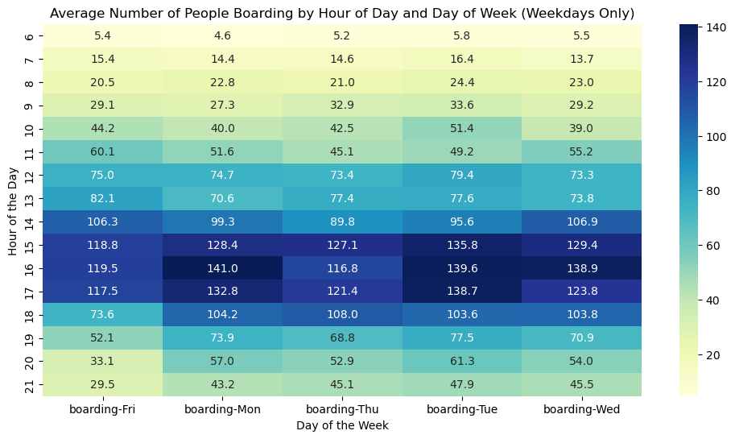
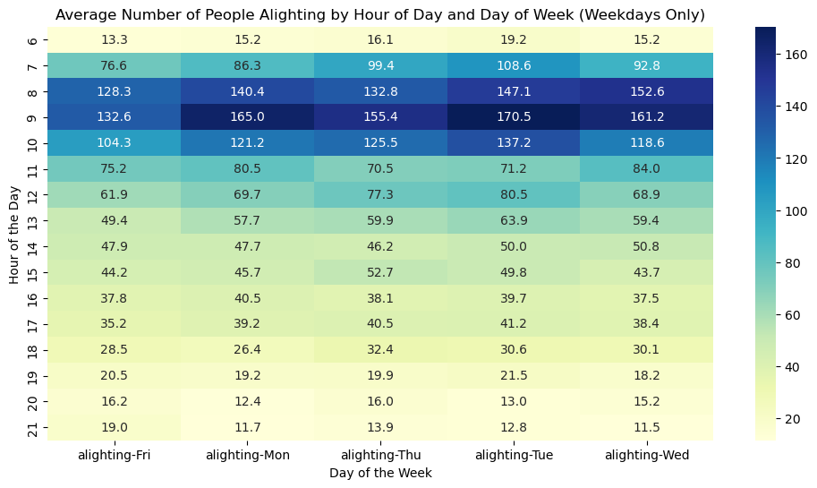
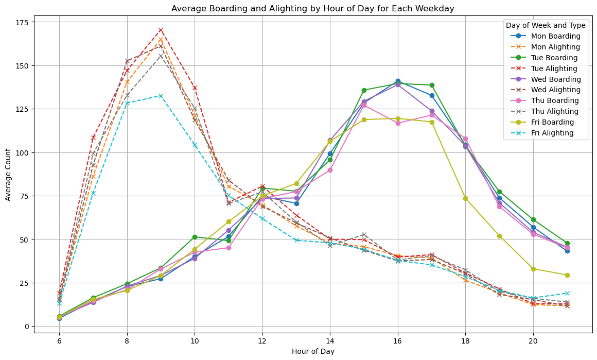

```python
import pandas as pd
```


```python
df = pd.read_csv('capmetro_UT.csv')
df.columns
df.isnull().sum()
```


    timestamp      0
    boarding       0
    alighting      0
    day_of_week    0
    temperature    0
    hour_of_day    0
    month          0
    weekend        0
    dtype: int64


```python
print('After examining the structure of the data, I decided to investigate how the average number of passengers boarding the buses and getting off the busses was different by day of the week and by the hour of the day.')
print('Since this data relates to the UT campus, I thought the most relevant data was the weekday data, so it was filtered on this basis.')
```

    After examining the structure of the data, I decided to investigate how the average number of passengers boarding the buses and getting off the busses was different by day of the week and by the hour of the day.
    Since this data relates to the UT campus, I thought the most relevant data was the weekday data, so it was filtered on this basis.


```python
import seaborn as sns
import matplotlib.pyplot as plt

# let's only look at weekdays for avg boarding numbers
weekday_data = df[df['weekend'] == 'weekday']
heatmap_data = weekday_data.groupby(['hour_of_day', 'day_of_week']).agg({'boarding': 'mean'}).unstack().fillna(0)

plt.figure(figsize=(12, 6))
sns.heatmap(heatmap_data, cmap='YlGnBu', annot=True, fmt='.1f', cbar=True)
plt.title('Average Number of People Boarding by Hour of Day and Day of Week (Weekdays Only)')
plt.xlabel('Day of the Week')
plt.ylabel('Hour of the Day')
```


    Text(120.72222222222221, 0.5, 'Hour of the Day')


    

    


```python
print('This heat map gives an hour-by-hour view of the busiest boarding times each day of the week. The darker blue, the busier the hour.')
```

    This heat map gives an hour-by-hour view of the busiest boarding times each day of the week. The darker blue, the busier the hour.


```python
# let's see same thing for avg alighting
weekday_data = df[df['weekend'] == 'weekday']
heatmap_data_alight = weekday_data.groupby(['hour_of_day', 'day_of_week']).agg({'alighting': 'mean'}).unstack().fillna(0)

plt.figure(figsize=(12, 6))
sns.heatmap(heatmap_data_alight, cmap='YlGnBu', annot=True, fmt='.1f', cbar=True)
plt.title('Average Number of People Alighting by Hour of Day and Day of Week (Weekdays Only)')
plt.xlabel('Day of the Week')
plt.ylabel('Hour of the Day')
```


    Text(120.72222222222221, 0.5, 'Hour of the Day')


    

    


```python
print('This heat map gives an hour-by-hour view of the busiest alighting times each day of the week. The darker blue, the busier the hour.')
print('The next plot will compare these two heatmaps in the same space.')
```

    This heat map gives an hour-by-hour view of the busiest alighting times each day of the week. The darker blue, the busier the hour.
    The next plot will compare these two heatmaps in the same space.


```python
hourly_ridership = weekday_data.groupby(['hour_of_day', 'day_of_week']).agg({'boarding': 'mean', 'alighting': 'mean'}).reset_index()

hourly_ridership['day_of_week'] = pd.Categorical(hourly_ridership['day_of_week'], categories=day_order, ordered=True)


plt.figure(figsize=(14, 8))
for day in day_order:
    day_data = hourly_ridership[hourly_ridership['day_of_week'] == day]
    plt.plot(day_data['hour_of_day'], day_data['boarding'], label=f'{day} Boarding', linestyle='-', marker='o')
    plt.plot(day_data['hour_of_day'], day_data['alighting'], label=f'{day} Alighting', linestyle='--', marker='x')

plt.title('Average Boarding and Alighting by Hour of Day for Each Weekday')
plt.xlabel('Hour of Day')
plt.ylabel('Average Count')
plt.legend(title='Day of Week and Type')
plt.grid(True)
plt.show()
```


    

    


```python
print('This graph clearly shows that the average number of people alighting is greater in the morning, and the average number of people baording is greater during the late afternoon/ early evening hours.')
print('For a university campus, morning periods might see a surge of people coming in from various locations, whereas in the evening, people are leaving the campus to return to different areas.')
print('At noon, it is notable that the average number of people boarding and alighting is approximately 75 across all days of the week. This consistent figure suggests that the lunch period might be a time when a diverse mix of bus riders—including students, faculty, and workers—are utilizing the buses at a relatively steady rate.')
```

    This graph clearly shows that the average number of people alighting is greater in the morning, and the average number of people baording is greater during the late afternoon/ early evening hours.
    For a university campus, morning periods might see a surge of people coming in from various locations, whereas in the evening, people are leaving the campus to return to different areas.
    At noon, it is notable that the average number of people boarding and alighting is approximately 75 across all days of the week. This consistent figure suggests that the lunch period might be a time when a diverse mix of bus riders—including students, faculty, and workers—are utilizing the buses at a relatively steady rate.

