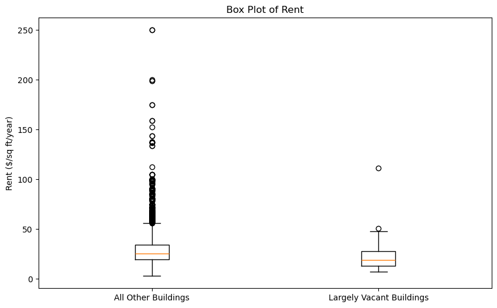
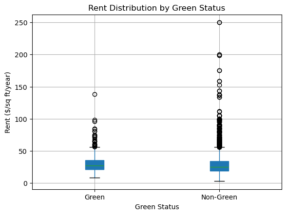
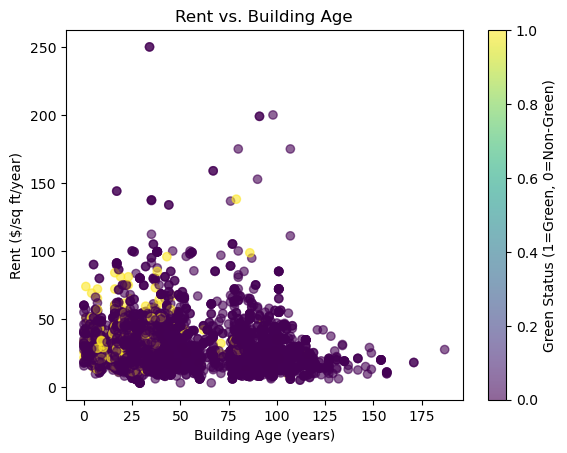
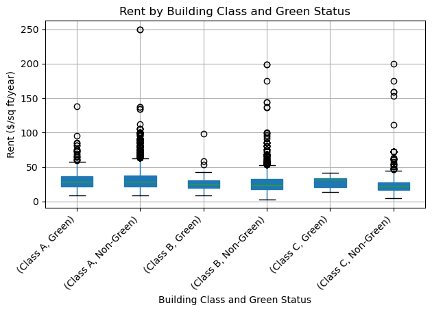
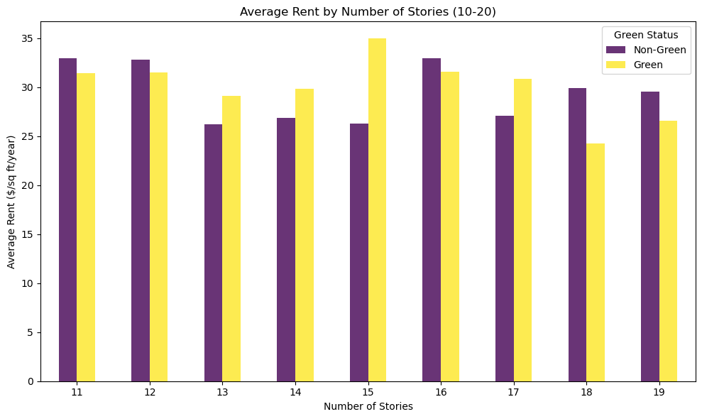

```python
import pandas as pd
import matplotlib.pyplot as plt
```


```python
df = pd.read_csv('greenbuildings.csv')
df.columns
```


    Index(['CS_PropertyID', 'cluster', 'size', 'empl_gr', 'Rent', 'leasing_rate',
           'stories', 'age', 'renovated', 'class_a', 'class_b', 'LEED',
           'Energystar', 'green_rating', 'net', 'amenities', 'cd_total_07',
           'hd_total07', 'total_dd_07', 'Precipitation', 'Gas_Costs',
           'Electricity_Costs', 'cluster_rent'],
          dtype='object')


```python
print('In revisiting the report from the Excel Guru, my main goals are to: ')
print(' 1. Ensure that the Guru did not neglect any important information in the data')
print(' 2. Give a couple of visualizations to demonstrate the information')
print(' 3. Provide my recommendation for investing in a green building')
```

    In revisiting the report from the Excel Guru, my main goals are to: 
     1. Ensure that the Guru did not neglect any important information in the data
     2. Give a couple of visualizations to demonstrate the information
     3. Provide my recommendation for investing in a green building


```python
largely_vacant_buildings = df[df['leasing_rate'] <= 0.10]  
non_vacant_buildings = df[df['leasing_rate'] > 0.10]

plt.figure(figsize=(10, 6))
plt.boxplot([non_vacant_buildings['Rent'], largely_vacant_buildings['Rent']], labels=['All Other Buildings', 'Largely Vacant Buildings'])
plt.title('Box Plot of Rent')
plt.ylabel('Rent ($/sq ft/year)')

print("The first thing I did was ensure that the guru's removal of the low occupancy buildings was valid.")
print('This plot shows the distribution of rent prices for the non-vacant buildings and the near-vacant buildings.')
print('The largely vacant buildings are classified by having an occupancy of less than 10% in the building.')
```

    The first thing I did was ensure that the guru's removal of the low occupancy buildings was valid.
    This plot shows the distribution of rent prices for the non-vacant buildings and the near-vacant buildings.
    The largely vacant buildings are classified by having an occupancy of less than 10% in the building.


    

    


```python
print('Since the distribution of the rent prices for the largely vacant buildings is similar to that of all the other buildings, we can confirm that removing these instances is justified and not introducing any bias.')
```

    Since the distribution of the rent prices for the largely vacant buildings is similar to that of all the other buildings, we can confirm that removing these instances is justified and not introducing any bias.


```python
print('The second thing I did was check for any confounding variables for the relationship between rent and green status.')
print('If there is presence of a confounding variable, it could mean that a building being a greenbuiling/ not a green building does not directly influence rent price.')
print('It is important to explore other variables and their relationships with building type (green or not green) and rent price.')
print('First we will look at the overall differnce in rent price between green and non-green buildings.')
```

    The second thing I did was check for any confounding variables for the relationship between rent and green status.
    If there is presence of a confounding variable, it could mean that a building being a greenbuiling/ not a green building does not directly influence rent price.
    It is important to explore other variables and their relationships with building type (green or not green) and rent price.
    First we will look at the overall differnce in rent price between green and non-green buildings.


```python
df['green_status'] = df['green_rating'].apply(lambda x: 'Green' if x == 1 else 'Non-Green')

df.boxplot(column='Rent', by='green_status', patch_artist=True)
plt.title('Rent Distribution by Green Status')
plt.suptitle('')  # Suppress the default title - learned this from ChatGPT
plt.xlabel('Green Status')
plt.ylabel('Rent ($/sq ft/year)')
```


    Text(0, 0.5, 'Rent ($/sq ft/year)')


    

    


```python
print('The plot above shows that the distribution of rent between green buildings and non-green buildings are relatively similar.')
print('The median rent price in green builings is slightly higher than in non-green buildings, but  non-green buildings have some outliers that have very high rent prices.')

print("Next, let's see how green buildings and non-green buildings are related across other variables.")
```

    The plot above shows that the distribution of rent between green buildings and non-green buildings are relatively similar.
    The median rent price in green builings is slightly higher than in non-green buildings, but  non-green buildings have some outliers that have very high rent prices.
    Next, let's see how green buildings and non-green buildings are related across other variables.


```python
# rent and building age 
plt.scatter(df['age'], df['Rent'], c=df['green_rating'], cmap='viridis', alpha=0.6)
plt.title('Rent vs. Building Age')
plt.xlabel('Building Age (years)')
plt.ylabel('Rent ($/sq ft/year)')
plt.colorbar(label='Green Status (1=Green, 0=Non-Green)')

```


    <matplotlib.colorbar.Colorbar at 0x142359a90>


    

    


```python
print('We see a similar rent trend across different ages for both green and non-green buildings, which suggests age might not be a confounding factor')
print("There are a few outliers that have very high prices for rent among the non-green buildings.")
```


```python
#  Rent by Building Class with Green Status
df['building_class'] = df.apply(lambda row: 'Class A' if row['class_a'] == 1 else ('Class B' if row['class_b'] == 1 else 'Class C'), axis=1)
df.boxplot(column='Rent', by=['building_class', 'green_status'], patch_artist=True)
plt.title('Rent by Building Class and Green Status')
plt.suptitle('') 
plt.xlabel('Building Class and Green Status')
plt.ylabel('Rent ($/sq ft/year)')
plt.xticks(rotation=45, ha='right') # this line i got ChatGPT to help me
plt.tight_layout() # this line ChatGPT helped me 

# the last two lines I used ChatGPT to help me figure out how to adjust the x-axis labels so that they don't intersect
```


    

    


```python
print('The main pattern I noticed here is that the variability in rent price in non-green buildings is higher than in green buildings.')
print('If we compare rent price in the same beuiling class, on average the green buildings have higher rent. However, the non-green builings show more variability.')
```

    The main pattern I noticed here is that the variability in rent price in non-green buildings is higher than in green buildings.
    If we compare rent price in the same beuiling class, on average the green buildings have higher rent. However, the non-green builings show more variability.


```python
# average rent by number of stories and green status
agg_df = df.groupby(['stories', 'green_rating']).agg({'Rent': 'mean'}).reset_index()

# only really interested in looking at buildings similar to the kind of building we would be investing in (15 stories)
filtered_df = agg_df[(agg_df['stories'] > 10) & (agg_df['stories'] < 20)]

pivot_df = filtered_df.pivot(index='stories', columns='green_rating', values='Rent')

pivot_df.plot(kind='bar', figsize=(10, 6), colormap='viridis', alpha=0.8)

plt.title('Average Rent by Number of Stories (10-20)')
plt.xlabel('Number of Stories')
plt.ylabel('Average Rent ($/sq ft/year)')
plt.legend(title='Green Status', labels=['Non-Green', 'Green'])
plt.xticks(rotation=0)
plt.tight_layout()

```


    

    


```python
print('This plot we looked at how rent differs by the number of stories in a building. It is interesting to note here that the average rent for 15 story buildings is significantly higher in green buildings.')
print('This is important because the building investment is for a 15 story building, and a 15 story green building has the highest rent price among comparable buildings (10-20 story buildings.')
```

    This plot we looked at how rent differs by the number of stories in a building. It is interesting to note here that the average rent for 15 story buildings is significantly higher in green buildings.
    This is important because the building investment is for a 15 story building, and a 15 story green building has the highest rent price among comparable buildings (10-20 story buildings.


```python
print("After taking a deeper dive into how different variables are influencing rent price between green and non-greeen buildings, it's clear that the non-green buildings have a broader range of rents.") 
print(" Non-green building typically have a few outlier prices on the high end of the spectrum,  while on average green buildings have higher rent.")
print("This suggests that non-green buildings may be of varying quality, location, or type, leading to different rent prices.")
print("Green buildings show a more consistent rent range. This could imply that these buildings are more uniform in terms of quality, amenities, and location, which results in more predictable rent prices.")
```

    After taking a deeper dive into how different variables are influencing rent price between green and non-greeen buildings, it's clear that the non-green buildings have a broader range of rents.
     Non-green building typically have a few outlier prices on the high end of the spectrum,  while on average green buildings have higher rent.
    This suggests that non-green buildings may be of varying quality, location, or type, leading to different rent prices.
    Green buildings show a more consistent rent range. This could imply that these buildings are more uniform in terms of quality, amenities, and location, which results in more predictable rent prices.


```python
print("Based on the analysis of rent variability and the financial projections, I would strongly recommend investing in a green building. Despite the wider range of rent prices observed in non-green buildings, the consistency in rent pricing across various factors in green buildings is a significant advantage. This consistency not only helps in more reliable financial planning but also aligns with a growing market preference for sustainable practices.")
print("I agree with the guru's analysis of the return on investment over time, and I think that investing in the green building is an economically good idea.")
```

    Based on the analysis of rent variability and the financial projections, I would strongly recommend investing in a green building. Despite the wider range of rent prices observed in non-green buildings, the consistency in rent pricing across various factors in green buildings is a significant advantage. This consistency not only helps in more reliable financial planning but also aligns with a growing market preference for sustainable practices.
    I agree with the guru's analysis of the return on investment over time, and I think that investing in the green building is an economically good idea.

